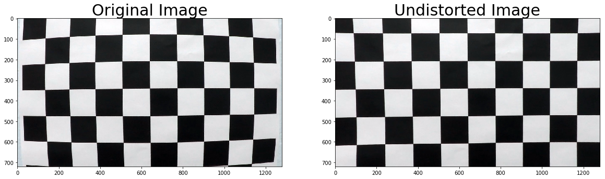
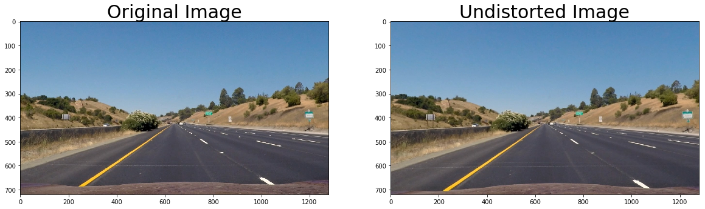
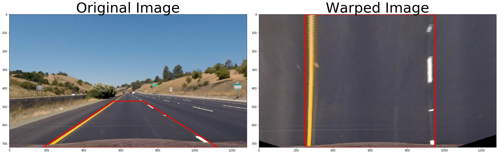
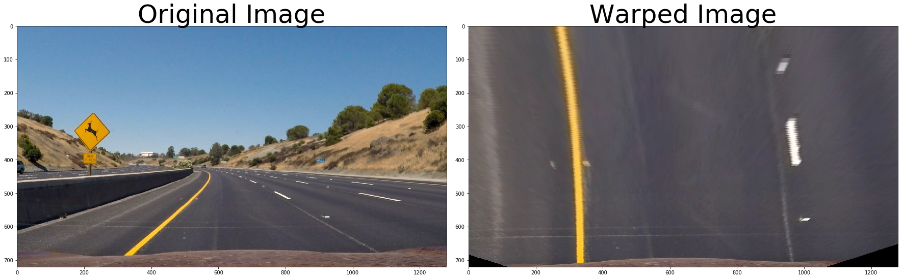
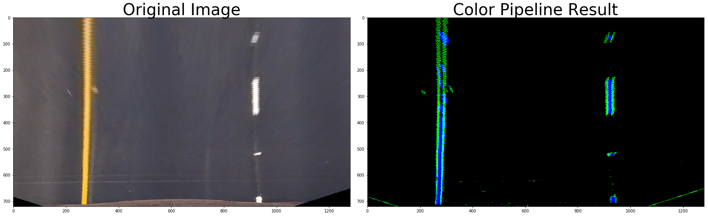
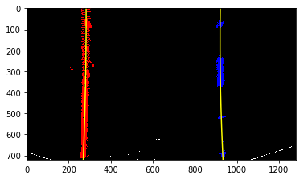
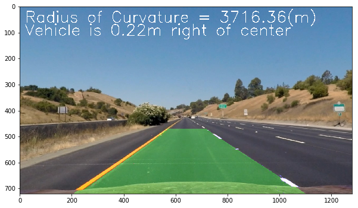

# Advanced Lane Finding Project

### The goals / steps of this project are the following:

* Compute the camera calibration matrix and distortion coefficients given a set of chessboard images.
* Apply a distortion correction to raw images.
* Use color transforms, gradients, etc., to create a thresholded binary image.
* Apply a perspective transform to rectify binary image ("birds-eye view").
* Detect lane pixels and fit to find the lane boundary.
* Determine the curvature of the lane and vehicle position with respect to center.
* Warp the detected lane boundaries back onto the original image.
* Output visual display of the lane boundaries and numerical estimation of lane curvature and vehicle position.

---
## Rubric Points
#### Here I will consider the rubric points individually and describe how I addressed each point in my implementation.  

---
###Writeup / README

####1. Provide a Writeup / README that includes all the rubric points and how you addressed each one.  

You're reading it!

---
###Camera Calibration

####1. Briefly state how you computed the camera matrix and distortion coefficients. Provide an example of a distortion corrected calibration image.

The code for this step is contained in the following cell code sections of the IPython notebook located in **`P4.ipynb`**. OpenCV functions `findChessboardCorners()` and `calibrateCamera()` were used to calibrate the correct camera matrix and distortion coefficients. Undistortion demonstration on a test checkerboard.

 2. Extracting "object points" and "image points" for camera calibration using chessboard images: _`create_points_for_calibration()`_

 3. Compute the camera calibration matrix and distortion using objpoints and imgpoints
 Using `objpoints` and `imgpoints` which are needed for camera calibration, this cell calibrates and calculates distortion coefficients.: _`calibrate_camera()`_
 4. Save and Load. Save and Load the camera calibration results for later use: _`camera_cal_pickle.p`_

 5. Test undistortion on a chessboard image. We test undistortion on an image!



---
###Pipeline (single images)

####1. Provide an example of a distortion-corrected image.
To demonstrate this step, I will describe how I apply the distortion correction to one of the test images like this one:

 1. Apply a distortion correction to raw images. Road image test!




####2. Describe how (and identify where in your code) you performed a perspective transform and provide an example of a transformed image.

The code for my perspective transform includes a function called _`warper()`_ and a compute transform matrix fucntion _`compute_transofrm()`_ , which appear in the following code cell of the IPython notebook. It may prove helpful to create the birds-eye perspective first. The reason is that error pixels in the binary get stretched out when the birds-eye transformation is performed second.

1. Apply a perspective transform to rectify binary image ("birds-eye view").

2. warper function: _`warper()`_  This function takes as inputs an image (`img`), and a tranform matrix (`M`). 

3. Calculate transform matrices:_`compute_transform`_
The source (`src`) and destination (`dst`) points are hardcode in the following manner: 

| Source        | Destination   | 
|:-------------:|:-------------:| 
| 180,720      | 250,720        | 
|560,470      | 250,0      |
| 725,470     | 950,0      |
| 1125,720      | 950,720        |


4.  Load and Save the transform and inverse perspective transform to map future detected lane lines: _`transform_pickle.p`_


5. Test the transform matrix




6. Check Warper on a curvy road image!





####3. Describe how (and identify where in your code) you used color transforms, gradients or other methods to create a thresholded binary image.  Provide an example of a binary image result.
I used a combination of color and gradient thresholds to generate a binary image (thresholding steps at following cells). The Sobel operator was applied successfully to the grayscale image to find x and y gradients and then thresholds were applied to the absolute x and combined magnitude and direction vectors. Color thresholding applied in the RGB, HSV and HSL channels. The R channel is a strong component of yellow and white. By better identifying yellows and whites, the pipeline can rely less on the gradients. This is especially important and helpful for dealing with shadows and variations in the road lighting and appearance. A combination of these results was used to produce binary images for finding likely lane pixels.  An example of my output for this step is shown bellow. 

**Using color transforms, gradients, etc., to create a thresholded binary image:**

**Note: I eventually chose not to use Magnitude and Direction Gradients**
 
2. Sobel Gradient functions
1- Sobel Gradient in 'x' direction: _`abs_sobel_thresh`()_
2- Magnitude of Sobel Gradient: _`mag_sobel_thresh()`_
3- Direction of Sobel Gradient: _`dir_sobel_thresh()`_

3. Color space conversion and thresholding. I used RGB, HSV and HSL channels. _`color_space_thresh()`_

4. Combining Color and Gradient thresholding methods: _`color_gradient_pipeline()`_

5. Checking the combined pipeline:



####4. Describe how (and identify where in your code) you identified lane-line pixels and fit their positions with a polynomial?

I  fit my lane lines with a 2nd order polynomial.  A histogram/sliding window method is used for identifying the left and right lane line pixels in a rectified binary image. The cv `polyfit()` function is used to fit curves to the identified pixels and they are used to calculate lane curvature and vehicle lane position. Once lines were found they were used to limit/focus the area of the search in the next frames. Sanity checks were used to reject unusable and unreasonable results. Averaging polynomials over a past frames is used to achieve smoother results.

The following cells where used in this process.

1. Line class to track lane lines. A class to receive the characteristics of each line detection: _`class Line()`_

2. Determine the curvature of the lane. Calculate the new radius of curvature using the formula provided in the lectures: _`finding_curvature()`_


3. Detect lane pixels and fit 2nd order polynomial to find the lane boundaries: _`finding_new_lines()`_


4. Look-Ahead Filter (eliminate sliding window step if lines already exist): _`finding_existing_lines()`_


5. Testing the line finding codes.





6. Sanity Check the validity of lane lines: _`sanity_check()`_ U.S. min and max curvature values are used to drop unacceptable radius values. 
OpenCV `matchShapes()` and `HausdorffDistanceExtractor()` functions were used: _`match_shapes()`_ It compares two shapes and returns an indication of how similar they are and what is their distance. Using it to compare the current polygon to one from a prior frame can provide a method for rejecting a bad frame by allowing the pipeline to use the last good polygon instead. Also, the best fit is a moving average of past fits with a __$smooth factor = 0.3$__.

**Note: Sanity check has been modified to rely more on previous values for the same line than reconstruct it from the other line** 


####5. Describe how (and identify where in your code) you calculated the radius of curvature of the lane and the position of the vehicle with respect to center.

I did this in the following cell:

1. Warp the detected lane boundaries back onto the original image and output visual display of the lane boundaries: _`draw_lines()`_. 
1- The distance between midpoint of image and middle of two found lanes is the distance from center and averaged over past frames. 
2- The minimum radius is selected as the final value for radius of curvature.


####6. Provide an example image of your result plotted back down onto the road such that the lane area is identified clearly.

1. Check the visual boundaries:





####7. The completed pipeline code


```python
def advanced_lines_pipeline(img, mtx, dist, M, Minv):
    undist_img = cv2.undistort(img, mtx, dist, None, mtx)
    binary,_ = color_gradient_pipeline(undist_img)
    binary_warped = warper(binary, M)
    
    if (advanced_lines_pipeline.left_line.detected == False)|(advanced_lines_pipeline.right_line.detected == False):
        advanced_lines_pipeline.left_line, advanced_lines_pipeline.right_line = \
        finding_new_lines(binary_warped, Line(), Line())
    else:
        advanced_lines_pipeline.left_line, advanced_lines_pipeline.right_line = \
        finding_existing_lines(binary_warped, advanced_lines_pipeline.left_line, advanced_lines_pipeline.right_line)
    
    advanced_lines_pipeline.left_line, advanced_lines_pipeline.right_line = sanity_check(advanced_lines_pipeline.left_line, advanced_lines_pipeline.right_line ,height = img.shape[0])
    result = draw_lines(undist_img,advanced_lines_pipeline.left_line, advanced_lines_pipeline.right_line, Minv)
    return result
```

---

###Pipeline ( test images and video)

####1. Provide your final video output.  

The following code blocks in notebook:

1. Check the pipeline on test images (resutls are saved into  "output_images" folder )


2. Check the pipline on few video frames  (resutls are saved into the "output_images/video" folder)

3. Generating the video output:


<video width="960" height="540" controls>
  <source src="project_output.mp4">
</video>

---
###Discussion

####1. Briefly discuss any problems / issues you faced in your implementation of this project.  Where will your pipeline likely fail?  What could you do to make it more robust?

The sanity check was the most difficult part of the project for me. I tried to run the pipeline on the challenge video and it cannot detect the lanes correctly. I think the following are the main cases that my pipeline is likely to fail:

1. Vertical high contrast pavement patterns.
2. There are many conditions exist that the sanity check should be tried on them, and each case needs proper resolution.
2. Different lighting conditions and change of lighting conditions, such as direct sunlight into the camera or moving from shadows to bright daylight road (tunnels).
3. Vertical shadows such as the road-side shadows from walls and barriers.


